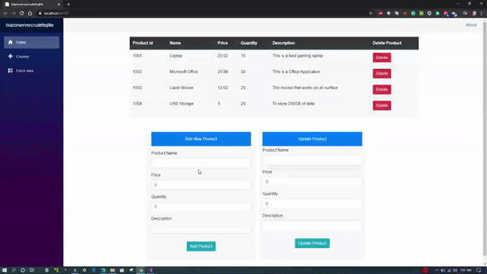

# blazorservercrudefsqlite
Example project to implement CRUD operation in SQLite database using EntityFrameworkCore

The complete details can be found at the blog post: https://executecommands.com/crud-in-blazor-using-sqlite-entity-framework/
